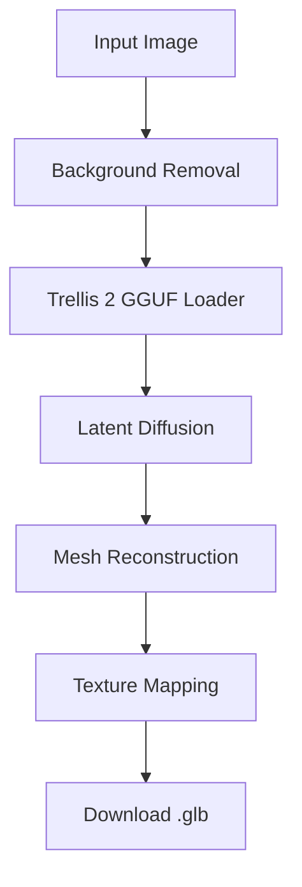

# Trellis 2 Generation Walkthrough

This guide provides a conceptual and visual walkthrough of the 3D generation process using the Trellis 2 model within ComfyUI.

## 1. Initial Setup Verification
Before running a generation, ensure your environment matches the following:
- **PyTorch**: 2.8.0+cu128
- **Arguments**: `--lowvram --force-fp16 --disable-pinned-memory`
- **VRAM Available**: ~6.0GB

## 2. The Generation Flow

### Phase A: Input Image Pre-processing
- **Load Image**: Drag and drop any 2D image (512x512 recommended).
- **Background Removal**: The Trellis node usually requires a clean alpha channel.
- **Normalization**: Ensuring the image aspect ratio matches the expected 1:1 input.

### Phase B: GGUF Model Loading
- **Load GGUF Checkpoint**: Point to the `trellis_v2_q4.gguf` file.
- **VRAM Offloading**: The system will partition the 4B parameter model between VRAM and system memory.

### Phase C: Latent Generation
- **Conditioning**: The 2D image is fed into the VAE/Diffusion stack.
- **Sampling**: Diffusion occurs. On a 6GB card, this is the most memory-intensive step.

### Phase D: Meshing & Texturing
- **Marching Cubes**: The latent space is converted into a 3D mesh (GLB/OBJ).
- **Texture Baking**: High-frequency details from the image are projected onto the mesh.

## 3. Visual Representation of Workflow

## 4. Expected Results
> [!TIP]
> A successful run on 6GB VRAM should take between **2-5 minutes** depending on the specific GPU clock speeds and system overhead.

---
*Created by Antigravity*
